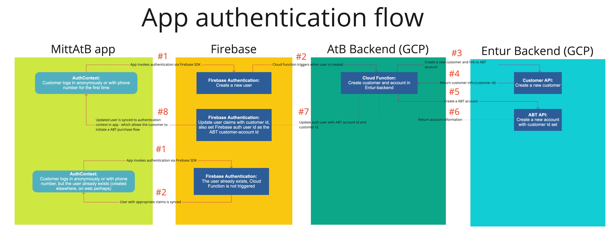
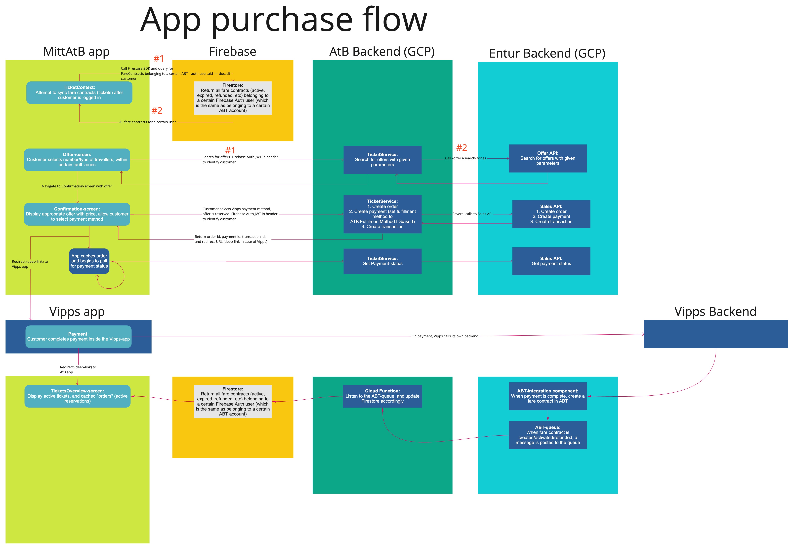

# App ABT flows

## Authentication flow
The customer must authenticate via Firebase Authentication, from the app, in order to initiate an ABT purchase. The same login credentials can be used from both web and app, so if a user already exists, then the same data is accessible from all platforms.

## Purchase and ticket synchronization
The customer must be authenticated in order to initiate a purchase or sync previously purchased fare contracts

