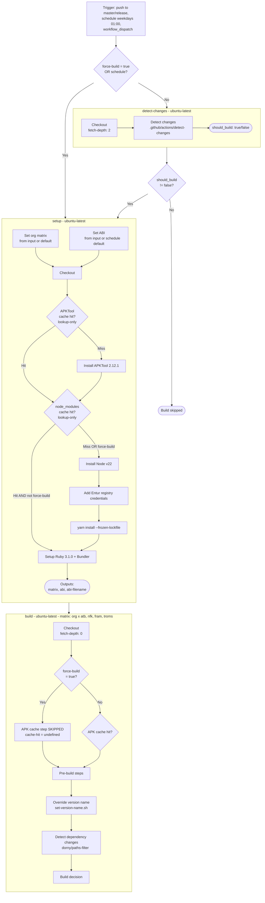
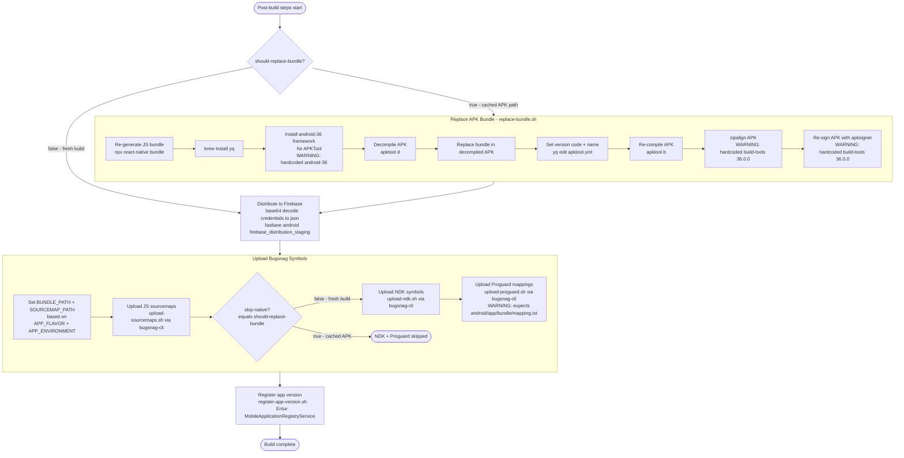
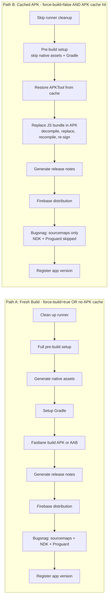
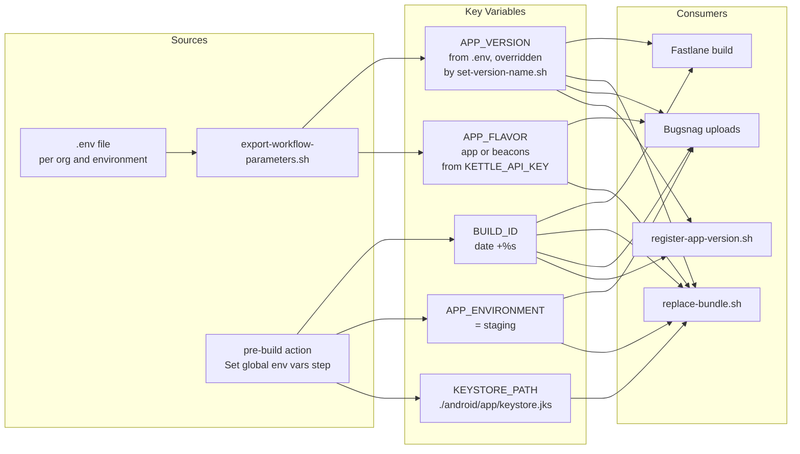

# Android Staging Build - Flow Graph

## High-level Job Flow

## Pre-build Steps - composite action

The `can-skip` input is `true` when `force-build != true AND apk-cache hit`.

```mermaid
flowchart TD
    start(["Pre-build steps start
    can-skip derived from
    force-build + apk cache"])

    start --> can_skip{"can-skip?"}

    can_skip -- "false - fresh build" --> cleanup["Clean up runner
    Remove dotnet, haskell,
    codeql, docker, large pkgs"]
    can_skip -- "true - cached APK" --> env_vars

    cleanup --> env_vars["Set global env vars
    BUILD_ID, APP_ENVIRONMENT,
    KEYSTORE_PATH, JAVA_HOME, etc."]

    env_vars --> decrypt["Decrypt env files
    git-crypt-unlock.sh
    NOTE: uses brew install git-crypt"]

    decrypt --> entur["Add Entur registry credentials
    add-entur-private-registry.sh"]

    entur --> imagemagick["Install imagemagick
    apt-get install"]

    imagemagick --> node["Install Node v22"]

    node --> nm_cache{"node_modules
    cache hit?"}
    nm_cache -- Miss --> yarn["yarn install --frozen-lockfile"]
    nm_cache -- Hit --> ruby
    yarn --> ruby["Setup Ruby 3.1.0 + Bundler"]

    ruby --> set_env["Set environment
    override-environment.sh
    WARNING: uses macOS-only sed syntax"]

    set_env --> export_env["Export workflow env vars
    export-workflow-parameters.sh
    sources set-app-flavor.sh"]

    export_env --> override_config["Override native config files
    android/override-config-files.sh
    WARNING: uses brew install xmlstarlet"]

    override_config --> decode_ks["Decode Android keystore
    create-keystore-file.sh"]

    decode_ks --> can_skip2{"can-skip?"}

    can_skip2 -- "false - fresh build" --> gen_assets["Generate native assets
    yarn generate-native-assets"]
    can_skip2 -- "true - cached APK" --> done

    gen_assets --> gradle["Setup Gradle
    gradle/actions/setup-gradle@v5
    cache based on force-build flag"]

    gradle --> done(["Pre-build done"])
```

## Build Decision and Fastlane

## Post-build Steps - composite action

The `should-replace-bundle` input is `true` when `force-build != true AND apk-cache hit`.

## Two Main Paths Summary

## Trigger Conditions Reference

| Trigger | force-build | detect-changes runs? | inputs.org | inputs.abi | inputs.output-type |
|---------|------------|---------------------|------------|-----------|-------------------|
| push to master/release | N/A - empty | Yes | default: all 4 | default fallback: arm64-v8a, armeabi-v7a | default: APK |
| schedule - cron | N/A - empty | No - skipped | default: all 4 | hardcoded: all 4 ABIs | default: APK |
| workflow_dispatch force=false | false | Yes | user input | user input | user input |
| workflow_dispatch force=true | true | No - skipped | user input | user input | user input |

## Key Environment Variables Flow

