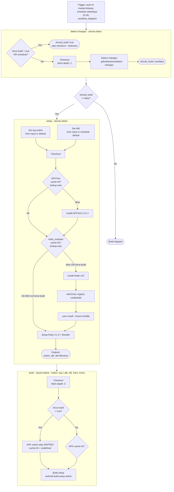
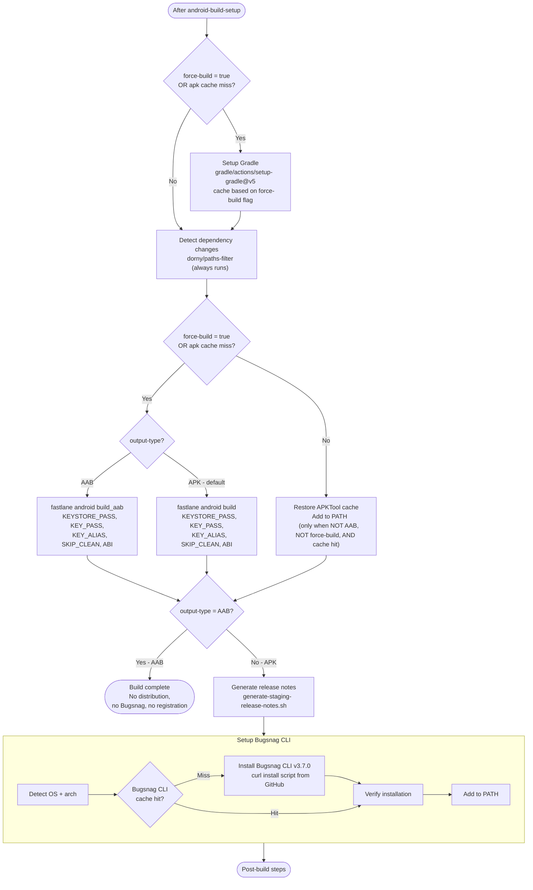
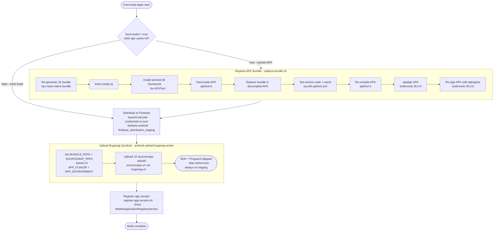
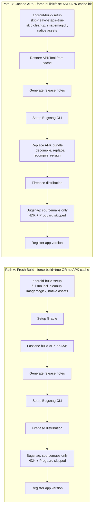
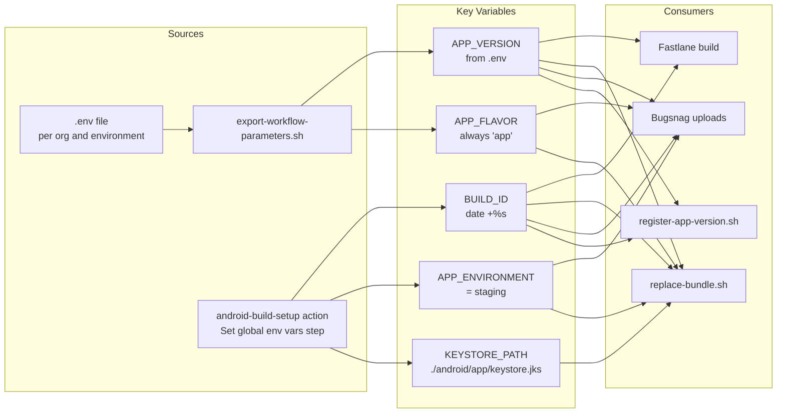

# Android Staging Build - Flow Graph

## High-level Job Flow

## Build Setup - shared composite action

The `skip-heavy-steps` input is `true` when `force-build != true AND apk-cache hit`.
This action is shared between staging and store builds.

```mermaid
flowchart TD
    start(["android-build-setup start
    inputs: app-environment, org,
    git-crypt-key, keystore,
    entur credentials, skip-heavy-steps"])

    start --> heavy_check1{"skip-heavy-steps?"}

    heavy_check1 -- "false" --> cleanup["Clean up runner
    Remove dotnet, haskell,
    codeql, docker, large pkgs"]
    heavy_check1 -- "true" --> env_vars

    cleanup --> env_vars["Set global env vars
    BUILD_ID, APP_ENVIRONMENT,
    KEYSTORE_PATH, APK/AAB_FILE_NAME,
    JAVA_HOME, linuxbrew PATH"]

    env_vars --> decrypt["Decrypt env files
    git-crypt-unlock.sh"]

    decrypt --> entur["Add Entur registry credentials
    add-entur-private-registry.sh"]

    entur --> heavy_check2{"skip-heavy-steps?"}
    heavy_check2 -- "false" --> imagemagick["Install imagemagick
    apt-get install"]
    heavy_check2 -- "true" --> node

    imagemagick --> node["Install Node v22
    with yarn cache"]

    node --> yarn["yarn install --frozen-lockfile"]

    yarn --> ruby["Setup Ruby 3.1.0 + Bundler"]

    ruby --> set_env["Set environment
    override-environment.sh"]

    set_env --> export_env["Export workflow env vars
    export-workflow-parameters.sh"]

    export_env --> override_config["Override native config files
    android/override-config-files.sh"]

    override_config --> decode_ks["Decode Android keystore
    create-keystore-file.sh"]

    decode_ks --> heavy_check3{"skip-heavy-steps?"}

    heavy_check3 -- "false" --> gen_assets["Generate native assets
    yarn generate-native-assets"]
    heavy_check3 -- "true" --> done

    gen_assets --> done(["android-build-setup done"])
```

## Build Steps After Setup

## Post-build Steps

These steps are now inline in the workflow, not in a separate composite action.

## Two Main Paths Summary

## Trigger Conditions Reference

| Trigger | force-build | detect-changes behavior | inputs.org | inputs.abi | inputs.output-type |
|---------|------------|------------------------|------------|-----------|-------------------|
| push to master/release | N/A - empty | Runs full detection | default: all 4 | default fallback: arm64-v8a, armeabi-v7a | default: APK |
| schedule - cron | N/A - empty | Short-circuits to should_build=true | default: all 4 | hardcoded: all 4 ABIs | default: APK |
| workflow_dispatch force=false | false | Runs full detection | user input | user input | user input |
| workflow_dispatch force=true | true | Short-circuits to should_build=true | user input | user input | user input |

## Key Environment Variables Flow

