# Android Staging Build — Flow Graph

## High-level Job Flow


## Pre-build Steps (composite action)

The `can-skip` input is `true` when `force-build != true AND apk-cache hit`.

```mermaid
flowchart TD
    start([Pre-build steps start<br/><i>can-skip derived from<br/>force-build + apk cache</i>])

    start --> can_skip{can-skip?}

    can_skip -- "false (fresh build)" --> cleanup[Clean up runner<br/><i>Remove dotnet, haskell,<br/>codeql, docker, large pkgs</i>]
    can_skip -- "true (cached APK)" --> env_vars

    cleanup --> env_vars[Set global env vars<br/><i>BUILD_ID, APP_ENVIRONMENT,<br/>KEYSTORE_PATH, JAVA_HOME, etc.</i>]

    env_vars --> decrypt[Decrypt env files<br/><i>git-crypt-unlock.sh<br/>⚠️ uses brew install git-crypt</i>]

    decrypt --> entur[Add Entur registry credentials<br/><i>add-entur-private-registry.sh</i>]

    entur --> imagemagick[Install imagemagick<br/><i>apt-get install</i>]

    imagemagick --> node[Install Node v22]

    node --> nm_cache{node_modules<br/>cache hit?}
    nm_cache -- Miss --> yarn[yarn install --frozen-lockfile]
    nm_cache -- Hit --> ruby
    yarn --> ruby[Setup Ruby 3.1.0 + Bundler]

    ruby --> set_env[Set environment<br/><i>override-environment.sh<br/>⚠️ uses sed -i '' (macOS syntax)</i>]

    set_env --> export_env[Export workflow env vars<br/><i>export-workflow-parameters.sh<br/>→ sources set-app-flavor.sh</i>]

    export_env --> override_config[Override native config files<br/><i>android/override-config-files.sh<br/>⚠️ uses brew install xmlstarlet</i>]

    override_config --> decode_ks[Decode Android keystore<br/><i>create-keystore-file.sh</i>]

    decode_ks --> can_skip2{can-skip?}

    can_skip2 -- "false (fresh build)" --> gen_assets[Generate native assets<br/><i>yarn generate-native-assets</i>]
    can_skip2 -- "true (cached APK)" --> done

    gen_assets --> gradle[Setup Gradle<br/><i>gradle/actions/setup-gradle@v5<br/>cache based on force-build flag</i>]

    gradle --> done([Pre-build done])
```

## Build Decision & Fastlane


## Post-build Steps (composite action)

The `should-replace-bundle` input is `true` when `force-build != true AND apk-cache hit`.

```mermaid
flowchart TD
    start([Post-build steps start])

    start --> replace_check{should-replace-bundle?}

    replace_check -- "true (cached APK path)" --> replace_bundle
    replace_check -- "false (fresh build)" --> firebase

    subgraph replace_bundle ["Replace APK Bundle (replace-bundle.sh)"]
        rb_bundle[Re-generate JS bundle<br/><i>npx react-native bundle</i>]
        rb_yq[brew install yq]
        rb_framework[Install android-36 framework<br/>for APKTool<br/><i>⚠️ hardcoded android-36</i>]
        rb_decompile[Decompile APK<br/><i>apktool d</i>]
        rb_replace[Replace bundle in decompiled APK]
        rb_version[Set version code + name<br/><i>yq edit apktool.yml</i>]
        rb_recompile[Re-compile APK<br/><i>apktool b</i>]
        rb_align[zipalign APK<br/><i>⚠️ hardcoded build-tools/36.0.0</i>]
        rb_sign[Re-sign APK<br/><i>apksigner<br/>⚠️ hardcoded build-tools/36.0.0</i>]

        rb_bundle --> rb_yq --> rb_framework --> rb_decompile
        rb_decompile --> rb_replace --> rb_version
        rb_version --> rb_recompile --> rb_align --> rb_sign
    end

    replace_bundle --> firebase

    firebase[Distribute to Firebase<br/><i>base64 decode credentials → json<br/>fastlane android firebase_distribution_staging</i>]

    firebase --> bugsnag_upload

    subgraph bugsnag_upload ["Upload Bugsnag Symbols"]
        bs_set[Set BUNDLE_PATH + SOURCEMAP_PATH<br/><i>based on APP_FLAVOR + APP_ENVIRONMENT</i>]
        bs_sourcemaps[Upload JS sourcemaps<br/><i>upload-sourcemaps.sh → bugsnag-cli</i>]
        bs_native_check{skip-native?<br/><i>= should-replace-bundle</i>}
        bs_ndk[Upload NDK symbols<br/><i>upload-ndk.sh → bugsnag-cli</i>]
        bs_proguard[Upload Proguard mappings<br/><i>upload-proguard.sh → bugsnag-cli<br/>⚠️ expects android/app/bundle/mapping.txt</i>]
        bs_skip_native([NDK + Proguard skipped])

        bs_set --> bs_sourcemaps --> bs_native_check
        bs_native_check -- "false (fresh build)" --> bs_ndk --> bs_proguard
        bs_native_check -- "true (cached APK)" --> bs_skip_native
    end

    bugsnag_upload --> register[Register app version<br/><i>register-app-version.sh<br/>→ Entur MobileApplicationRegistryService</i>]

    register --> done([Build complete])
```



## Two Main Paths Summary

```mermaid
flowchart LR
    subgraph fresh ["Path A: Fresh Build<br/>(force-build=true OR no APK cache)"]
        direction TB
        f1[Clean up runner] --> f2[Full pre-build setup]
        f2 --> f3[Generate native assets]
        f3 --> f4[Setup Gradle]
        f4 --> f5[Fastlane build APK/AAB]
        f5 --> f6[Generate release notes]
        f6 --> f7[Firebase distribution]
        f7 --> f8[Bugsnag: sourcemaps + NDK + Proguard]
        f8 --> f9[Register app version]
    end

    subgraph cached ["Path B: Cached APK<br/>(force-build=false AND APK cache hit)"]
        direction TB
        c1[Skip runner cleanup] --> c2[Pre-build setup<br/><i>skip native assets + Gradle</i>]
        c2 --> c3[Restore APKTool from cache]
        c3 --> c4[Replace JS bundle in APK<br/><i>decompile → replace → recompile → re-sign</i>]
        c4 --> c5[Generate release notes]
        c5 --> c6[Firebase distribution]
        c6 --> c7[Bugsnag: sourcemaps only<br/><i>NDK + Proguard skipped</i>]
        c7 --> c8[Register app version]
    end
```



## Trigger Conditions Reference

| Trigger | `force-build` | `detect-changes` runs? | `inputs.org` | `inputs.abi` | `inputs.output-type` |
|---------|--------------|----------------------|--------------|-------------|---------------------|
| `push` to master/release | N/A (empty) | Yes | default: all 4 | default fallback: `arm64-v8a,armeabi-v7a` | default: APK |
| `schedule` (cron) | N/A (empty) | No (skipped) | default: all 4 | hardcoded: all 4 ABIs | default: APK |
| `workflow_dispatch` force=false | `'false'` | Yes | user input | user input | user input |
| `workflow_dispatch` force=true | `'true'` | No (skipped) | user input | user input | user input |

## Key Environment Variables Flow


