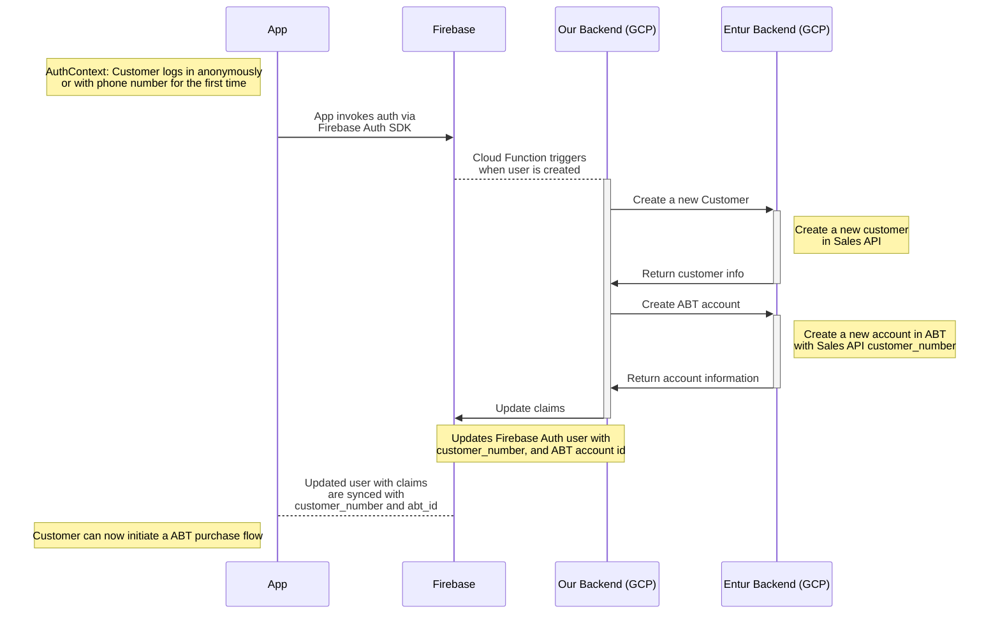
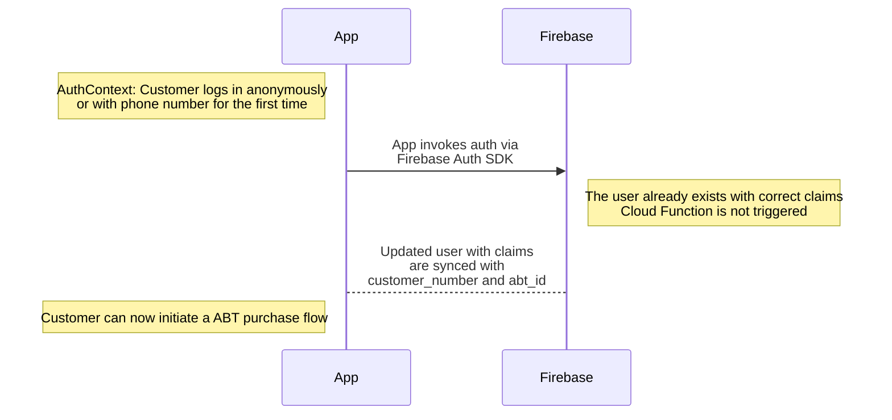
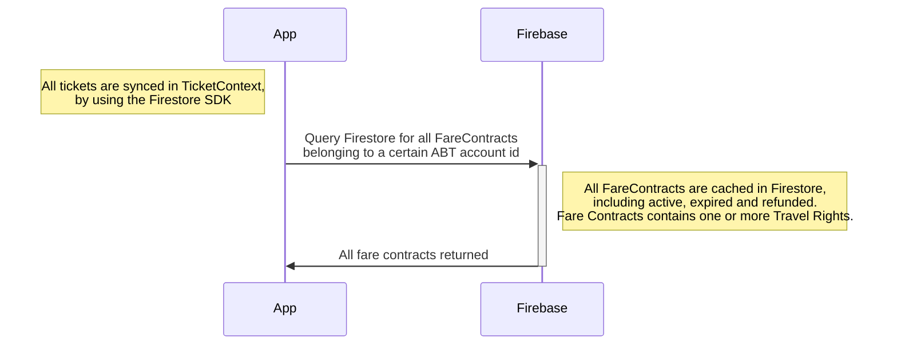
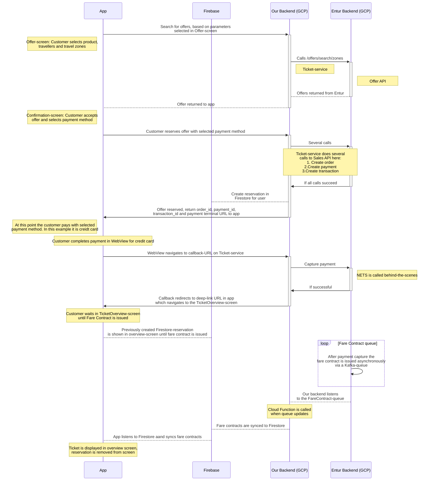

# Authentication and purchase flows flows

## Authentication flow

The customer must authenticate via Firebase Authentication, from the app, in order to initiate a purchase via Account Based Ticketing. The same login credentials can be used from both web and app, so if a user already exists, then the same data is accessible from all platforms.

### New user

The first time a user logs in we create a Firebase Auth user. This user is specific to our APIs. After the Firebase Auth user is created, we have to create a customer as well as as an account in the Entur backend. The IDs of the Entur entities are synchronized back to our Firebase Auth user.

### Existing user

If we already have an existing user, we do not have to trigger any extra operations beyond communicating with Firebase Auth in order to log in.

## Purchase flow and ticket synchronization

The customer must be authenticated in order to initiate a purchase or sync previously purchased fare contracts

- FareContract: An order in the Account Based Ticketing, containing one or more travel rights (translated from Customer Purchase Package)
- Travel Right: An entity which can loosely be compared to a ticket, which gives a customer a right to travel by some means of transportation.

### Ticket synchronization

When opening the app, and the Firebase Auth user has been synced, we then query a Firestore collection specific to the user in order to retrieve their tickets (fare contracts containing travel rights).

### Purchase flow

