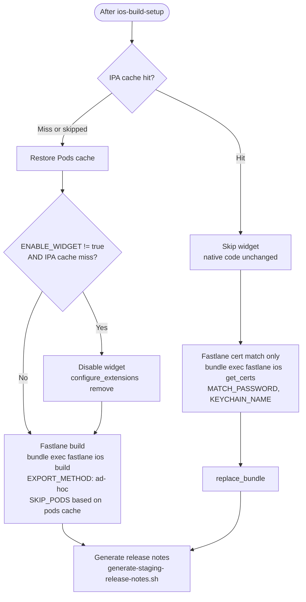
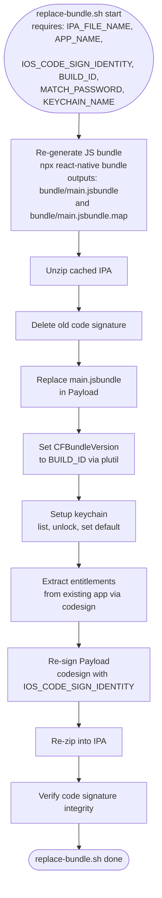
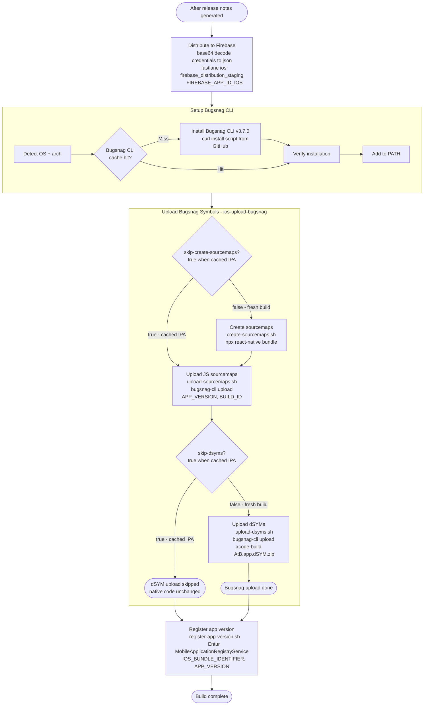
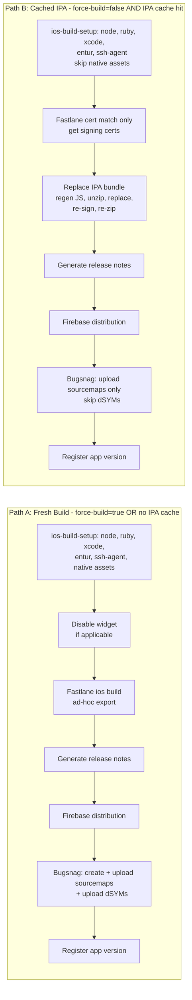
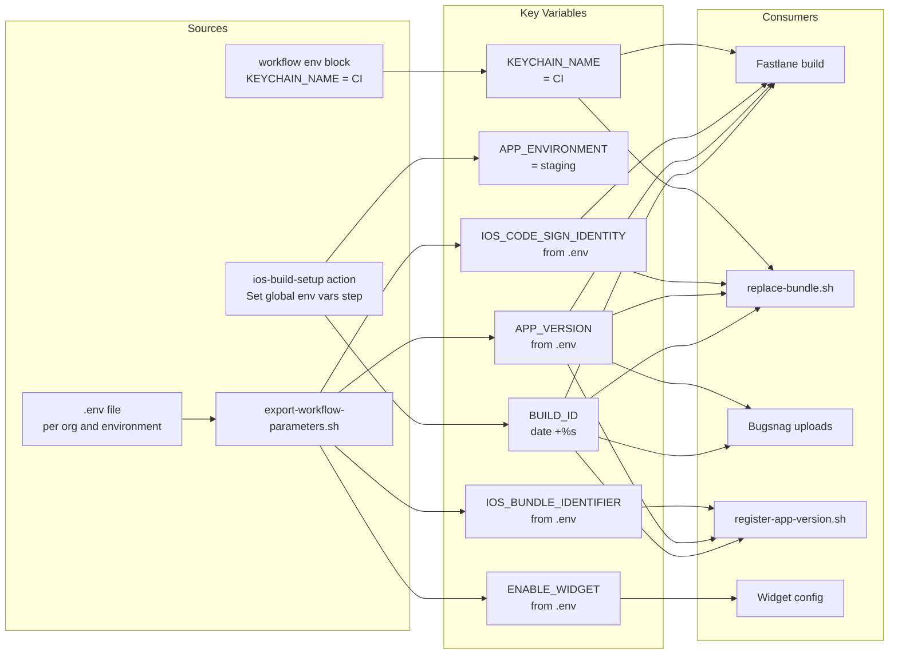

# iOS Staging Build - Flow Graph

## High-level Job Flow

```mermaid
flowchart TD
    trigger["Trigger: push to master/release,
    schedule weekdays 01:00,
    workflow_dispatch"]

    trigger --> detect_changes

    subgraph detect_changes ["detect-changes - ubuntu-latest"]
        force_check{"force-build = true
        OR schedule?"}
        force_check -- Yes --> force_build(["should_build: true
        skip checkout + detection"])
        force_check -- No --> dc_checkout["Checkout
        fetch-depth: 2"]
        dc_checkout --> dc_detect["Detect changes
        .github/actions/detect-changes"]
        dc_detect --> dc_out(["should_build: true/false"])
    end

    detect_changes --> should_build_check{"should_build
    != false?"}
    should_build_check -- No --> skip_all(["Build skipped"])
    should_build_check -- Yes --> setup

    subgraph setup ["setup - macOS-26"]
        direction TB
        sm["Set org matrix
        from input or default"]
        sm --> checkout_s["Checkout"]

        checkout_s --> pods_cache_s{"Pods cache hit?
        lookup-only"}
        pods_cache_s --> modules_cache_s{"node_modules
        cache hit?
        lookup-only"}

        modules_cache_s -- "Miss OR force-build" --> install_node_s["Install Node v22"]
        modules_cache_s -- "Hit AND not force-build" --> entur_check

        install_node_s --> entur_check{"node_modules
        cache hit?"}

        entur_check -- Miss --> entur_s["Add Entur registry credentials"]
        entur_check -- Hit --> yarn_check

        entur_s --> yarn_check{"force-build = true
        OR cache miss?"}

        yarn_check -- Yes --> yarn_s["yarn install --frozen-lockfile"]
        yarn_check -- No --> ruby_s

        yarn_s --> ruby_s["Setup Ruby 3.1.0 + Bundler"]

        ruby_s --> xcode_check{"force-build = true
        OR pods cache miss?"}
        xcode_check -- Yes --> xcode_s["Setup Xcode
        latest-stable"]
        xcode_check -- No --> setup_out

        xcode_s --> pods_install["Install CocoaPods
        bundle exec pod install"]
        pods_install --> setup_out(["Output: matrix"])
    end

    setup --> build_ios

    subgraph build_ios ["build-ios - macOS-26 - matrix: org x atb, nfk, fram, troms"]
        direction TB
        b_checkout["Checkout"]
        b_checkout --> ipa_check{"force-build = true?"}
        ipa_check -- Yes --> ipa_skip["IPA cache step SKIPPED
        cache-hit = undefined"]
        ipa_check -- No --> ipa_cache{"IPA + dSYM
        cache hit?"}

        ipa_skip --> ios_build_setup["iOS build setup
        composite action
        skip-heavy-steps based on cache"]
        ipa_cache --> ios_build_setup

        ios_build_setup --> build_path["Build path decision"]
    end
```



## iOS Build Setup - composite action

```mermaid
flowchart TD
    start(["ios-build-setup start"])

    start --> env_vars["Set global env vars
    BUILD_ID, APP_ENVIRONMENT"]

    env_vars --> decrypt["Decrypt env files
    git-crypt-unlock.sh
    uses brew install git-crypt"]

    decrypt --> entur["Add Entur registry credentials
    add-entur-private-registry.sh"]

    entur --> node["Install Node v22"]

    node --> ruby["Setup Ruby 3.1.0 + Bundler"]

    ruby --> nm_check{"force-build = true?"}

    nm_check -- Yes --> yarn_install["yarn install --frozen-lockfile"]
    nm_check -- No --> nm_cache{"node_modules
    cache hit?"}

    nm_cache -- Miss --> yarn_install
    nm_cache -- Hit --> xcode

    yarn_install --> xcode["Setup Xcode version
    default: latest-stable"]

    xcode --> netrc["Copy .netrc
    for Mapbox API token"]

    netrc --> set_env["Set environment
    override-environment.sh
    copies .env, icons, google-services, etc."]

    set_env --> export_env["Export workflow env vars
    export-workflow-parameters.sh
    sets APP_VERSION, APP_FLAVOR, etc."]

    export_env --> override_config["Override native config files
    ios/override-config-files.sh
    updates Info.plist reCAPTCHA URL schemes"]

    override_config --> ssh_agent["Setup SSH agent
    for Match private key"]

    ssh_agent --> heavy_check{"skip-heavy-steps
    = true?"}

    heavy_check -- No --> gen_assets["Generate native assets
    remove Python symlinks
    brew install imagemagick
    yarn generate-native-assets"]

    gen_assets --> done(["ios-build-setup done"])
    heavy_check -- Yes --> done
```



## Build Path Decision



## Replace IPA Bundle - cached path

When the IPA is cached, the JS bundle is regenerated and re-injected into the cached IPA.



## Distribution and Bugsnag Upload



## Two Main Paths Summary



## Trigger Conditions Reference

| Trigger | force-build | detect-changes behavior | inputs.org |
|---------|------------|------------------------|------------|
| push to master/release | N/A - empty | Runs full detection | default: all 4 orgs |
| schedule - cron | N/A - empty | Short-circuits to should_build=true | default: all 4 orgs |
| workflow_dispatch force=false | false | Runs full detection | user input |
| workflow_dispatch force=true | true | Short-circuits to should_build=true | user input |

## Key Environment Variables Flow



## IPA Cache Key Components

The IPA cache key determines whether a fresh build or bundle replacement occurs:

```
key: {org}-ipa-app-ios-cache-{hash ios/**}-{hash .yalc/**}-{hash .env}-{hash assets*/}
```

| Component | What it captures |
|-----------|-----------------|
| org | Per-organization cache separation |
| ios/** | Any change to native iOS code, Podfile, xcodeproj, etc. |
| .yalc/** | Local package overrides |
| .env | Environment configuration changes |
| assets*/ | Asset directory changes |

If any of these change, the IPA cache misses and a fresh build is triggered.
